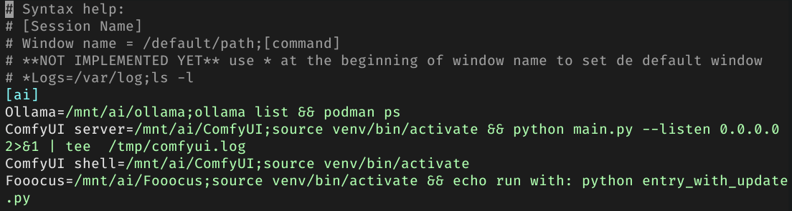
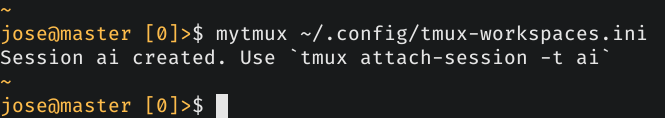
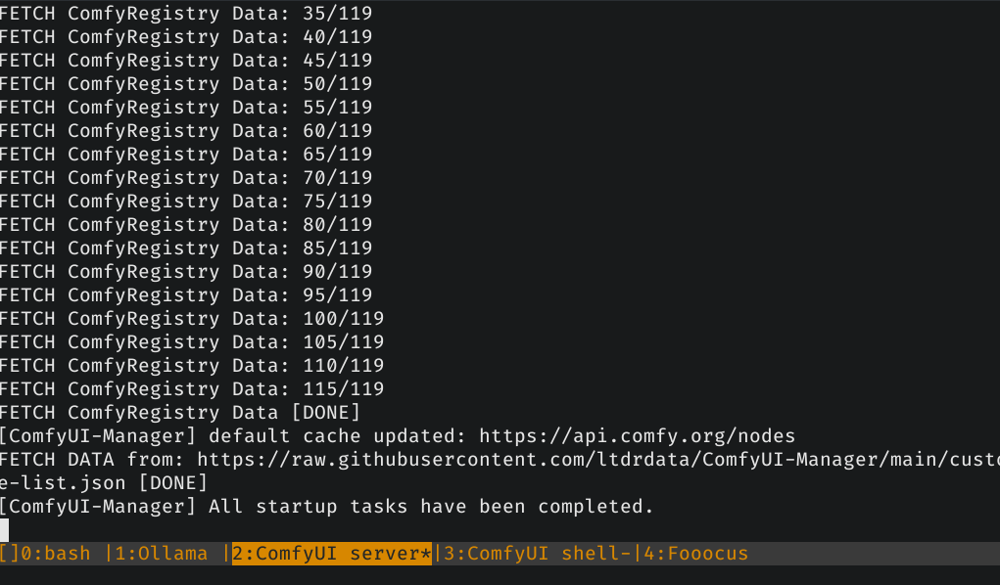

# MyTmux

## ¿Qué es MyTmux?

MyTmux te permite crear una o varias sesiones de Tmux con sus respectivas ventanas y opcionalmente ejecutar comandos en dichas ventanas en el momento de crearlas.

Todo se configura en un fichero ini con una sintaxis muy sencilla.

## Cómo usar

Sólo hay que llamar a `mytmux` indicando el fichero de configuración. Por ejemplo

```bash
mytmux ~/.config/tmux-workspaces.ini
```

## Fichero de configuración

Consiste en un fichero ini con las sesiones y ventanas que queremos crear:

```ini
[mi_sesion]
ventana1=/ruta/por/defecto
ventana2=/otra/ruta;df -h
logs=/tmp;ls *.log

[mi_otra_sesion]
Home=~;fastfetch
#(...)
```

Puedes añadir tantas secciones como quieras al ini (cada sección es una sesión de tmux).

Cada entrada `clave=valor` dentro de una sección corresponde a una ventana.

El comando tras el `;` es opcional. Si se indica, se ejecutará automáticamente al crear la ventana.

Este es una muestra de mi fichero personal para que veas su potencial, la sesión `ai` la utilizo para diversos proyectos de IA:

```ini
[ai]
Ollama=/mnt/ai/ollama;ollama list && podman ps
ComfyUI server=/mnt/ai/ComfyUI;source venv/bin/activate && python main.py --listen 0.0.0.0 2>&1 | tee  /tmp/comfyui.log
ComfyUI shell=/mnt/ai/ComfyUI;source venv/bin/activate
Fooocus=/mnt/ai/Fooocus;source venv/bin/activate && echo run with: python entry_with_update.py
```

### Un ejemplo real

#### Esta es mi configuración

Tengo algunos terminales ejecutando programas de IA, Ollama, ComfyUI Server, ComfyUI shell (con venv) and Fooocus.



Para crear una sesión `Tmux` ejecuto `mytmux` con ese fichero



Depués de `attach`la sesión, todos los tabs han sido creados y los comandos ejecutados.




### Explicación

Esto me crea una sesión llamada `ai` con 4 ventanas:

`Ollama | ComfyUi server | ComfyUI shell | Fooocus`

Ollama lo tengo en 2 contenedores, la parte GUI y el server. Me interesa saber al iniciar los lenguajes que tengo y el estado de los contenedores. De ahí el comando.

Con ComfyUI y Fooocus, activo el venv automáticamente además de otros comandos que no es necesario explicar.

## TODO

- Implementar la ventana activa por defecto. Ahora mismo la ventana activa es la última.
- Crear paneles. No están implementados porque nunca los uso, me gusta tener la ventana completa y cambiar de pestañas con el teclado.
